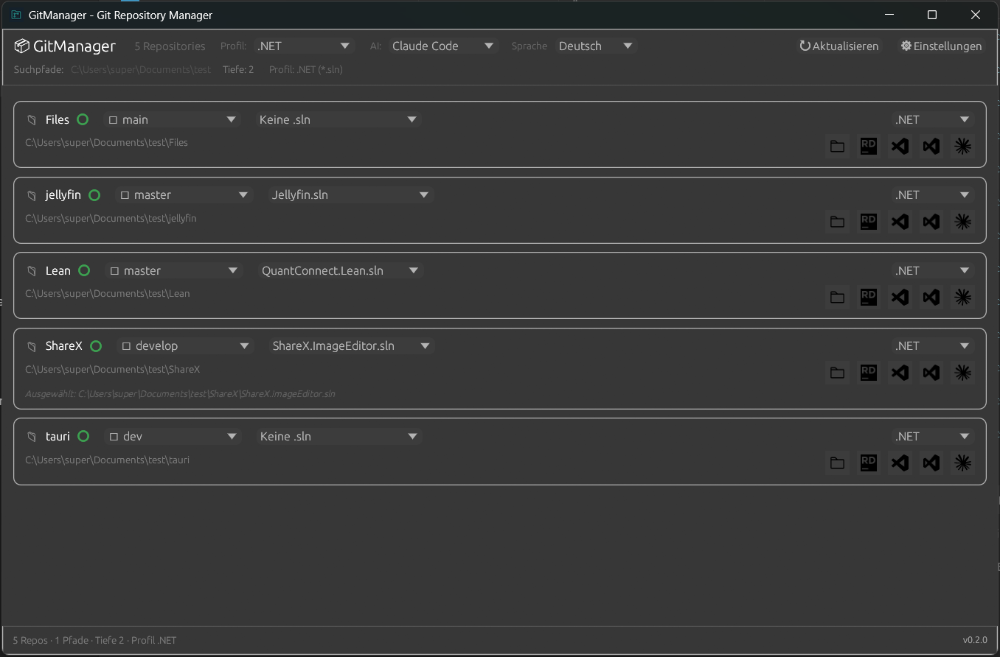

# GitManager

> Lightweight Git repository manager for Windows — written in Rust, ships as a single portable `.exe` (<15 MB, <60 MB RAM, <300 ms startup).


[](https://github.com/TimAltmann/gitmanager/actions)

**Language / Sprache:** English | [Deutsch](#-spracheinstellung) — the app itself supports **English and German** (switch in the top bar or `Settings → Language`). This README is in English.

## 🎬 Demo


*Main window – repo list, branch & solution dropdowns, IDE/agent buttons (dirty indicator, profile override, one-click open in VS / VS Code / Rider & AI agents).*

**Demo-Video:** [▶ assets/demo.mp4](assets/demo.mp4) · Direkt-Link: https://github.com/TimAltmann/gitmanager/blob/main/assets/demo.mp4

<video src="assets/demo.mp4" controls width="800" poster="assets/demo.png">
  Your browser does not support the video tag. <a href="https://github.com/TimAltmann/gitmanager/blob/main/assets/demo.mp4">Watch demo.mp4</a>
</video>

---

## 📥 Download & Installation

> **TL;DR — no installation needed. Download, double-click, add a folder in Settings, done.**

### Option 1 — GitHub Releases (recommended)

1. Go to **Releases** → https://github.com/TimAltmann/gitmanager/releases
2. Download `gitmanager.exe` (or `gitmanager-msvc.exe` for MSVC build)
3. Double-click to run — portable, no installer, no admin rights.

> CI builds also publish the `.exe` as a workflow artifact on every push to `main` (see `Actions → CI → Artifacts`).

### Option 2 — Build from source (no local Rust needed, via Docker)

**Linux / WSL:**
```bash
./scripts/build.sh
# -> ./gitmanager.exe + target/x86_64-pc-windows-gnu/release/gitmanager.exe
```

**Windows PowerShell:**
```powershell
.\scripts\build.ps1
```

**Manual (Docker):**
```bash
# GNU target (simple, needs mingw)
docker compose run --rm dev cargo build --target x86_64-pc-windows-gnu --release

# MSVC target (smaller, recommended for Store/AV)
docker compose run --rm dev cargo xwin build --target x86_64-pc-windows-msvc --release

# Tests & local run (Linux, no GUI in container)
docker compose run --rm dev cargo test
```

After building: double-click `gitmanager.exe`. On first launch go to `⚙ Settings` → add a path like `C:\Dev` → Save. The default profile `.NET` (scans `*.sln`) is pre-selected.

### Requirements

- **Runtime:** Windows 10/11 (the `.exe` runs anywhere; built via cross-compile).
- **Build only:** Docker + Docker Compose *or* a local Rust toolchain (`rustup target add x86_64-pc-windows-gnu`).

---

## ✨ Features

| Area | What it does |
|------|--------------|
| **🔍 Fast scan** | Scans configurable root paths (1–10 depth) for Git repos. `WalkDir + rayon` → ~500 repos in <1s. |
| **🌿 Branch management** | Dropdown with search + `↻` refresh (local + remote `origin/*`). `git fetch --all` via button. Switch only when clean; if dirty: dialog `Stash & Switch` / `Force Discard`; if in merge/rebase: error only. |
| **● Dirty indicator** | `●` dirty / `○` clean (staged, unstaged, untracked — respects `.gitignore`). |
| **📄 Project files** | Per-repo solution/project files (e.g. `.sln` for .NET, `Cargo.toml` for Rust) — dropdown with search, depth 3, cap 20, per-repo profile override possible. |
| **🚀 Open in IDE** | One-click open via official brand icons: **Visual Studio** (`devenv` via `vswhere`), **VS Code** (`code`), **Rider** (`rider`). Fully configurable per language profile (`program` + `args` with `{file}` `{dir}` `{repo}` placeholders). |
| **🤖 AI agents** | Launch any CLI agent in a terminal (`wt` → `powershell` → `cmd` auto-detected, `cmd /K` keeps window open). Presets: Claude, Codex, Gemini, Copilot, Cursor, Aider — add your own. |
| **📂 Explorer** | Icon button (`explorer` / `xdg-open`). |
| **🔧 Config dropdowns** | Per-profile XML `key=value` switching (`App.config` `<add key="Database" value="...">`) – define `file`, `key`, options in `Settings → Languages/Profiles`, shown as dropdown per repo row. |
| **⚙ Profiles** | Language profiles (e.g. `.NET` → `*.sln`, `Rust` → `Cargo.toml`) + agents + terminal preference. Stored as `config.json` v7. |
| **🎨 Theming** | 5 themes: Light, Dark, Nord, Dracula, Solarized Light. Instant preview. |
| **🌐 Languages** | App UI in **English** and **German** — switch in the top bar (`Language`) or `Settings → Language`. |
| **🪶 Portable** | Single `.exe` ~5.4 MB (with icon + SVGs), no installer, config in `%APPDATA%\gitmanager\config\config.json` (atomic write, auto-migration from legacy `repomanager`). |

---

## 🌐 Language Settings

GitManager ships with **English (default) and German**:

- **Top bar:** `Language` dropdown (English / Deutsch) — changes instantly, persists to `config.json`.
- **Settings:** `Settings → Language` tab — same selector with larger preview.
- **Persistence:** `config.json → "language": "en" | "de"` (`v7`). Missing field defaults to `en` for backward compatibility.
- **Adding translations:** edit `src/i18n.rs` (`tr(lang, key)`) and add a new `Language` variant — the settings UI picks it up automatically.

> The legacy config path `%APPDATA%\repomanager\config\config.json` is automatically imported on first launch if `%APPDATA%\gitmanager\...` does not exist.

---

## ⚙ Configuration

Config lives at `%APPDATA%\gitmanager\config\config.json` (resolved via `directories::ProjectDirs::from("com","gitmanager","gitmanager")`):

```json
{
  "config_version": 7,
  "roots": ["C:\\Dev"],
  "max_depth": 2,
  "active_profile_id": "dotnet",
  "language": "en",
  "profiles": [
    {
      "id": "dotnet",
      "display_name": ".NET",
      "file_extension": ".sln",
      "file_pattern": "*.sln",
      "max_scan_depth": 3,
      "default_ide_id": "vs2022",
      "ides": [
        {"id":"vs2022","display_name":"Visual Studio","program":"devenv","args":["{file}"]},
        {"id":"vscode","display_name":"VS Code","program":"code","args":["{file}"]},
        {"id":"rider","display_name":"Rider","program":"rider","args":["{file}"]}
      ]
    }
  ],
  "agents": [
    {"id":"claude","display_name":"Claude Code","program":"claude","args":[],"launch_mode":"Terminal"}
  ],
  "active_agent_ids": ["claude"],
  "theme": "light",
  "terminal": {"preference":"auto","fallback":"cmd"},
  "repo_state": {
    "C:\\Dev\\MyApp": {"selected_solution":"C:\\Dev\\MyApp\\MyApp.sln","profile_override":null}
  }
}
```

- `file_extension` is normalized (`.slN` → `.sln`), `file_pattern` supports `*.sln` or exact names like `Cargo.toml` and comma-separated lists (`pom.xml,build.gradle`).
- `program` + `args` support placeholders `{file}`, `{dir}`, `{repo}`. `use_shell=false` by default for safety; `allow_unsafe` enables `&|;`.
- `terminal.preference`: `Auto` → `wt` → `powershell` → `cmd` (probed via `where`/`which`).

---

## 🛠 Development

```bash
# Build container
docker compose build

# Interactive shell
docker compose run --rm dev bash

# Tests / fmt / lint (inside container)
docker compose run --rm dev cargo test
docker compose run --rm dev cargo fmt
docker compose run --rm dev cargo clippy

# Without Docker (local Rust)
rustup target add x86_64-pc-windows-gnu
cargo build --release --target x86_64-pc-windows-gnu
cargo test
```

**Project layout:**
```
src/
  main.rs       # eframe bootstrap + load_icon (256) + image loaders
  app.rs        # MyApp, scan thread, branch dialog, top/status bars, language switch
  i18n.rs       # Language enum (En/De) + tr() translations
  config.rs     # AppConfig v7 (roots, profiles, agents, terminal, theme, language, repo_state) + migration
  git.rs        # RepoInfo, branches, checkout (safe/force/stash), fetch, launch_ide/agent, explorer
  scanner.rs    # WalkDir + rayon, scan_repos + scan_solutions_for_repo (depth 3, cap 20)
  ui/
    repo_list.rs  # Row: 📁 + dirty + branch combo (search+refresh) + solution combo + profile override + IDE/agent icons
    settings.rs   # Tabbed window: General, Languages/Profiles, AI Agents, Terminal, Appearance, Language
    theme.rs      # Light/Dark/Nord/Dracula/Solarized themes
assets/
  icon.ico/icon.png (6 sizes, winres)
  demo.png / demo.mp4 (Demo screenshot & screencast)
  icons/*.svg (Simple Icons CC0 + Phosphor MIT)
scripts/
  build.sh / build.ps1 (Docker → gitmanager.exe)
```

---

## 📦 Releases & Cross-compile Details

- **GNU (`x86_64-pc-windows-gnu`):** `mingw-w64` + `windres` symlink, simple, works everywhere. `strip=true` + `whole-archive` for `.rsrc`.
- **MSVC (`x86_64-pc-windows-msvc`):** `cargo-xwin` (fetches Windows SDK), smaller, preferred for Store/AV.
- **Release profile:** `opt-level="z"`, `lto=true`, `strip=true`, `panic="abort"` → ~5.4 MB (with icon+SVGs).

CI builds the GNU artifact on every push (see `.github/workflows/ci.yml`).

---

## 🎨 Icons & Licenses

This project bundles icons under `assets/icons/`:

- **Phosphor Icons** (`folder.svg`) — **MIT** — https://github.com/phosphor-icons/core/blob/main/LICENSE
- **Simple Icons** (`vscode.svg`, `visualstudio.svg`, `rider.svg`, `claude.svg`, `codex.svg`, `gemini.svg`, `copilot.svg`, `cursor.svg`, `aider.svg`) — **CC0 1.0 Universal** — https://github.com/simple-icons/simple-icons/blob/develop/LICENSE.md  
  The *collection* is CC0, but **individual brand icons are trademarks** of their owners:
  - Visual Studio Code / Visual Studio — Microsoft
  - Rider — JetBrains s.r.o.
  - Claude — Anthropic, Codex — OpenAI, Gemini — Google, Copilot — GitHub/Microsoft, Cursor — Cursor Inc., Aider — Paul Gauthier
- Use is **nominative fair use**: icons identify the target app when opening (`Open in VS Code`), not endorsement. When redistributing, keep `assets/icons/LICENSE.txt` and respect trademark guidelines:
  - VS Code: https://code.visualstudio.com/brand
  - Visual Studio: https://visualstudio.microsoft.com/license-terms/
  - JetBrains: https://www.jetbrains.com/company/brand/
  - Anthropic: https://www.anthropic.com/brand

Alternative: replace Simple Icons with generic Phosphor icons (`code`, `cube`, `sparkle`) — MIT + trademark-free, unified style. Current choice favors **official brand icons for recognizability**.

**Dependencies:** all crates.io dependencies use permissive licenses (MIT / Apache-2.0 / ISC / CC0) compatible with this project's MIT license. See `LICENSE` (project) and `THIRD_PARTY_LICENSES.md` (dependency notices). Run `cargo deny` / `cargo license` locally to audit.

---

## ❓ FAQ

**Q: Branch dropdown shows only the current branch?**  
A: It lists local + remote (`origin/*`) via `list_branches`. Use `↻` next to the branch dropdown for `git fetch --all` to pull new remote branches. Type in the dropdown to filter.

**Q: Branch switch fails?**  
A: If dirty → dialog (Stash & Switch / Force Discard / Cancel). If merge/rebase in progress → error only. Check `git status`, commit or stash manually.

**Q: VS / Rider button does nothing?**  
A: Program must be in `PATH`. For VS, `vswhere` at `C:\Program Files (x86)\...\vswhere.exe` is used; for Rider `rider`/`rider64.exe` or Toolbox shim. In Settings → Languages/Profile → IDE, set `program` to full path (e.g. `C:\...\devenv.exe`) if not found. Test with `where devenv`.

**Q: Claude/agent doesn't start?**  
A: `claude` must be in `PATH` (`where claude`). Check Settings → Terminal (Auto/Wt/Cmd/Powershell). `wt` (Windows Terminal) is preferred, fallback `cmd /K`.

**Q: Explorer doesn't open?**  
A: Uses `explorer <path>` (Windows) or `xdg-open` (Linux). Path must exist.

**Q: Scan finds no `.sln`?**  
A: Check profile (extension `.sln`, depth 3). `.sln` is often in subfolders — increase depth or keep `file_pattern` `*.sln`. Cap is 20, use search to filter.

**Q: Where is the `.exe`?**  
A: After Docker build at `./gitmanager.exe` (~5.4 MB, 11 sections incl. `.rsrc` for icon) and `target/x86_64-pc-windows-gnu/release/gitmanager.exe`. CI also publishes it as an artifact.

**Q: App language stuck in German / English?**  
A: Change via top bar `Language` dropdown or `Settings → Language`. The value is stored in `config.json` (`"language": "en"`). Delete the config file to reset to English.

**Q: Config from `repomanager` not showing?**  
A: On first launch GitManager imports the legacy config from `%APPDATA%\repomanager\config\config.json` if its own config does not exist yet, then saves to the new path.

**Q: Config dropdown shows error / missing value?**  
A: The selector reads `<add key="Database" value="...">` from `App.config` (or your configured `file_path`/`key`). Check `Settings → Languages/Profiles → Config dropdowns` – the file must exist in the repo root and contain the key. The dropdown tooltip shows `file:key = value` or the error (e.g. `Key 'Database' not found`). Switching the value rewrites the file atomically and rescans.

---

## 🤝 Contributing

PRs welcome! Please:

1. `cargo fmt` + `cargo clippy` + `cargo test` (or `docker compose run --rm dev cargo test`)
2. Keep portable, no admin required, <15 MB `.exe`.
3. For icon/brand changes, keep trademark notices intact.

---

## 📄 License

**MIT** — see `LICENSE`.  
Icon licenses: Phosphor MIT, Simple Icons CC0 1.0 + trademark notes (see `assets/icons/LICENSE.txt` and the `Icons & Licenses` section above).  
Third-party crate licenses: see `THIRD_PARTY_LICENSES.md`.

---

## 🙏 Acknowledgements

- [egui](https://github.com/emilk/egui) / [eframe](https://github.com/emilk/egui/tree/master/crates/eframe) for the immediate-mode GUI
- [libgit2](https://libgit2.org/) via [git2](https://crates.io/crates/git2) for Git operations
- [Phosphor Icons](https://phosphoricons.com/) and [Simple Icons](https://simpleicons.org/) for the icon sets
- `walkdir` + `rayon` for fast parallel scanning
